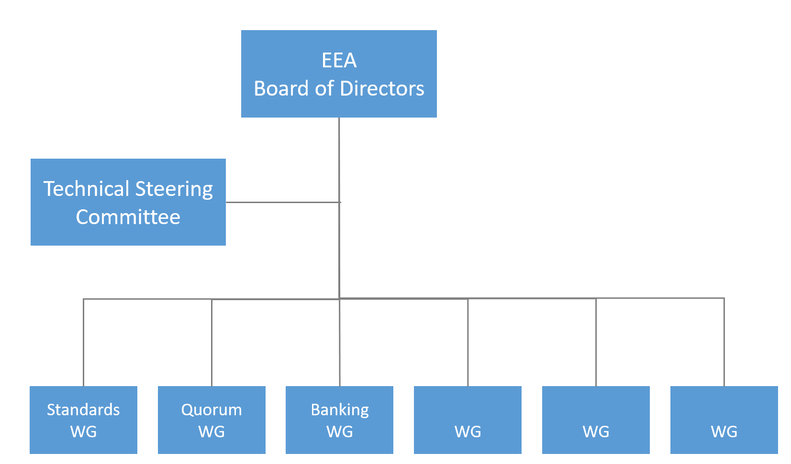
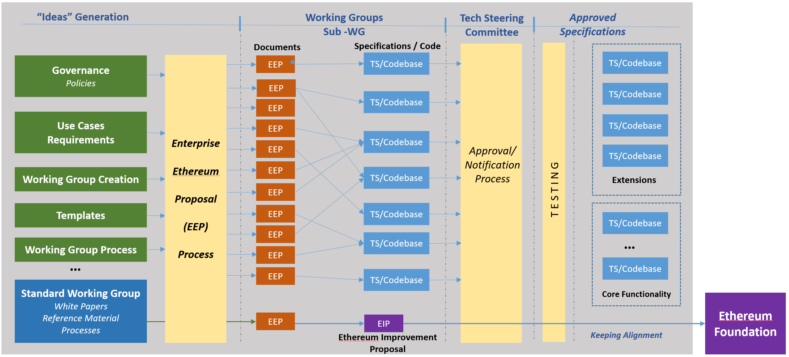
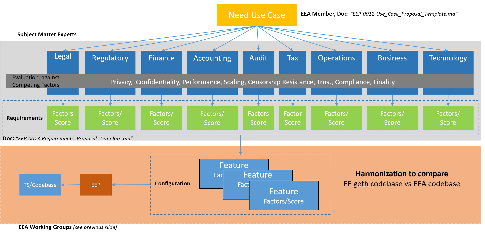
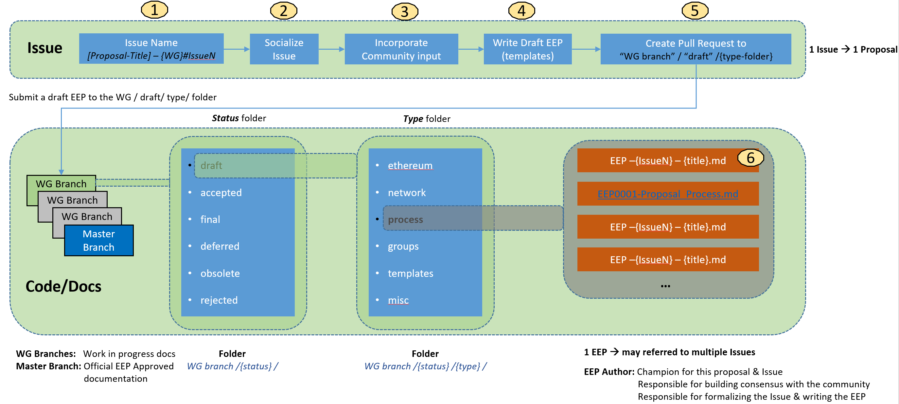

# EEPs
Enterprise Ethereum Proposals (EEPs) describe the standards for Enterprise Ethereum Alliance, including core protocol specifications, client APIs, and contract standards. EEPs are inspired by [EIPs](https://github.com/ethereum/EIPs). Read [EEP0001 Proposal Process](draft/process/EEP0001-Proposal_Process.md) to get started.

# EEA Structure

# EEA Overall Process

The EEA process is divided in the following stages:
## Ideas Generation
 * In this stage is where the "need" is define. The "need" needs to be written down in a EEP document. 
 * The "need" could cover different type of topics:
 
 Need                          | EEP Template                           | Description
 ------------------------------|----------------------------------------|-------------------------------------------------------
 Governance Policies           | TBD                                    |
 Use Cases                     | [EEP-0012-Use_Case_Proposal_Template]()    | This template provide guidelines on how to construct a use case.
 Requirements                  | [EEP-0013-Requirements_Proposal_Template]()| Template that can be used to convert the Use Case commercial requirements into technical requirements.
 Working Group Creation        | [EEP0009-Group_Proposal_Template](draf/templates/EEP0009-Group_Proposal_Template.md) | 
 Templates                     |                                        | Template for the creation of new templates.
 Working Group Process         |                                        | Template to define new or enhanced changes to a Working Group Process
 Standard Working Group        |                                        |
 
 ### Use Case Creation Process
 
 

 ### Enterprise Ethereum Proposal Document Process
 Depictured below.
 In this stage is where the EEPs are constructed. 
 

## Specifications Development
In this stage is where the actual Technical Specifications and Coe is developed.

### Construction of the EEPs
### Construction of Specifications/Code

## Approval & Notification Process
At this stage the Working Group submittes to the TSC the EEPs for approval.
The EPPs documents will be moved to a new status folder after the approval.

### Testing
This stage is dedicated to Testing the Technical Specifications.

### Maintenance
After the approval the specifications need to be maintained, based on the results of the Testing effort or on the comments received for the public community.
